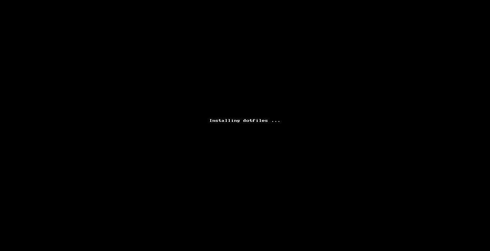
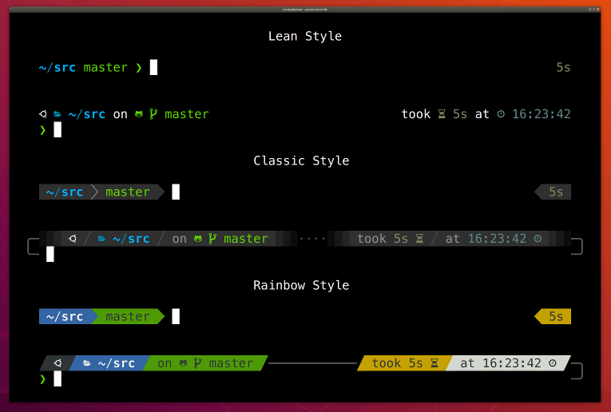

# dotfiles



## What's in there

### Using GNU Stow

> [GNU Stow][1] is a symlink farm manager which takes distinct sets of software and/or data located in separate directories on the filesystem, and makes them all appear to be installed in a single directory tree.

### OhMyZsh

[OhMyZsh][2] configured using [Antigen][3] and [powerlevel10k][4] theme:



OhMyZSH Plugins:

- ssh-agent
- gpg-agent
- autojump
- brew
- brew-cask
- colored-man-pages
- common-aliases
- docker
- docker-compose
- git
- git-extras
- git-hubflow
- git-remote-branch
- gitignore
- heroku
- history
- httpie
- mvn
- sudo
- rbenv
- jenv
- zsh-users/zsh-syntax-highlighting

### Homebrew

[Homebrew][5] formulas and casks installed and backed up in a bundle: `Brewfile`

- `brew bundle install` to install all the formulas and casks
- `brew bundle dump -f` to regenerate the `Brewfile`

### Atom

- `apm list --installed --bare | grep '^[^@]\+' -o > atom/atom-packages.txt`

### Git
- Global `.gitconfig`
- Global `.gitignore`

### Java
- JDKs installed with Hombrew
- [jEnv][6] installed with Hombrew
- Global `.mavenrc` using [jEnv][6]

### OBS Studio

All the obs-studio configurations, scenes and profiles

## How to install:
```sh
$ bash -c "$(curl -fsSL https://raw.githubusercontent.com/cchacin/dotfiles/master/install.sh)"
```

[1]: (https://www.gnu.org/software/stow/manual/stow.html)
[2]: (https://ohmyz.sh/)
[3]: (https://antigen.sharats.me/)
[4]: (https://github.com/romkatv/powerlevel10k)
[5]: (https://brew.sh/)
[6]: (https://www.jenv.be/)
